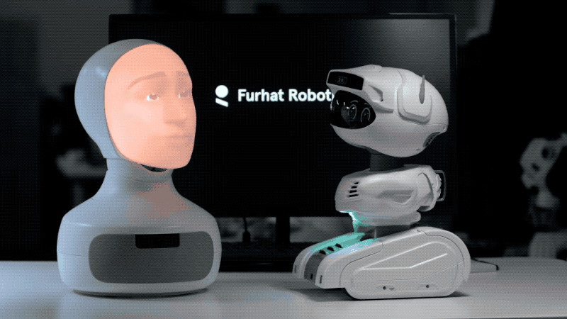

<h1 align="center"> 

 
 
Furhat – A "Bad" Waiter Skill
</h1>

This repository contains a small experiment with the Furhat Robot. This is a skill portraying a waiter that can iteratively take orders from a group of users with the option to randomly mess up some orders.

## The interaction
After a greeting the agent will ask if the users want to order. If so, the agent will iteratively ask each user for their choice of dish and drink until it has received an order from each user and finally summarizing the orders. However, there is also the option to make the agent "bad", in this case the agent will mess up the orders and the users will be given the chance to correct their choice.

 

## Usage
To preview this project you will need to install the [Furhat SDK](https://docs.furhat.io/getting_started/) and for the best experience you will also need [JetBrains InteliJ](https://www.jetbrains.com/idea/).

Before running the skill, first open the Furhat SDK and start the virtual Furhat. Once you have started the Furhat and downloaded or cloned this project, you can open it using InteliJ. To run the skill, open `kotlin/furhatos/app/main.kt` and press the play button (`▷`) in the top right corner of the IDE.

To run the "bad" waiter skill:

- Right click `main.kt` and go to `More Run/Debug -> Modify Run Configuration...`
- A modal will pop up and in the input field `Program arguments` put the value `--bad`
- Finally, press `▷ Run`